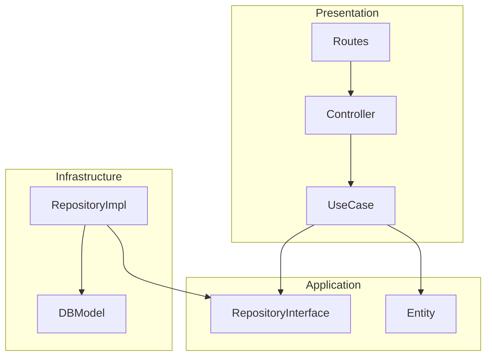

# 🚀 ZeekNet – Next-Gen Job Portal Platform

[](https://react.dev/)
[](https://nodejs.org/)
[](https://www.mongodb.com/)
[](https://www.typescriptlang.org/)
[](#-architecture)

ZeekNet is a high-performance, full-stack job portal designed with **Clean Architecture** principles. It delivers a seamless experience for job seekers, companies, and administrators through a modular, scalable, and maintainable codebase.

---

## 🌟 Key Features

### 🔍 For Job Seekers
- **Smart Search**: Advanced filtering by category, location, and salary.
- **Application Tracking**: Real-time status updates on your job applications.
- **Dynamic Profiles**: Build and showcase a professional digital resume.
- **Real-time Messaging**: Communicate directly with employers via an integrated chat system.

### 🏢 For Companies
- **Unified Dashboard**: Manage job postings, applicants, and company settings.
- **AI-Powered ATS**: Automated scoring and parsing for efficient candidate screening.
- **Verification System**: Secure company verification to maintain platform trust.
- **Subscription tiers**: Flexible plans integrated with **Stripe** for featured listings.

### 🛡️ For Administrators
- **Total Control**: Manage users, verifies companies, and moderates content.
- **Analytics Hub**: Deep insights into platform growth and engagement.
- **System Health**: Monitor live connections and background processes.

---

## 🛠️ Technology Stack

### Frontend Ecosystem
- **Core**: React 19, Vite, TypeScript
- **State**: Redux Toolkit (RTK)
- **Styling**: Tailwind CSS 4, Framer Motion
- **UI Components**: Radix UI primitives, Lucide React icons
- **Data Fetching**: Axios, Socket.io-client

### Backend Infrastructure
- **Runtime**: Node.js, Express
- **Database**: MongoDB (Mongoose ODM), Redis (Caching)
- **Real-time**: Socket.io
- **Security**: JWT (Access/Refresh tokens), Zod validation
- **Cloud**: AWS S3 (Media), Nodemailer (Emails), Stripe (Payments)
- **Intelligence**: Groq AI integration for ATS capabilities

---

## 🏗️ Architecture

ZeekNet follows **Clean Architecture** to ensure the business logic remains independent of external frameworks.



### Layer Responsibilities
- **Presentation**: Express routes, controllers, and middleware.
- **Application**: Business use cases and orchestration logic.
- **Domain**: Pure business entities and domain interfaces.
- **Infrastructure**: Database implementations and external API integrations.

---

## 🚀 Getting Started

### Prerequisites
- Node.js **v18+**
- MongoDB instance (Local or Atlas)
- Redis server (Optional for caching)

### 1. Installation
```bash
# Clone the repository
git clone https://github.com/shamnxd/ZeekNet.git
cd ZeekNet

# Install dependencies
cd client && npm install
cd ../server && npm install
```

### 2. Configuration
Create a `.env` in `server/` and `.env.local` in `client/` following the variables provided in the source code.

### 3. Execution
```bash
# Run both servers for development
# Terminal 1 (Backend)
cd server && npm run dev

# Terminal 2 (Frontend)
cd client && npm run dev
```

---

## 📁 Project Structure

```text
ZeekNet/
├── client/          # Vite-powered React Frontend
│   └── src/
│       ├── api/     # Service layer for API calls
│       ├── components/ # Atomic UI & Business components
│       └── store/   # Redux logic
└── server/          # Express-powered Backend
    └── src/
        ├── application/ # Use Case logic
        ├── domain/      # Business Entities
        ├── infrastructure/ # DB & Third-party services
        └── presentation/ # Routes & Controllers
```

---

## 🤝 Contributing
Contributions are what make the open-source community such an amazing place to learn, inspire, and create. Any contributions you make are **greatly appreciated**.

1. Fork the Project
2. Create your Feature Branch (`git checkout -b feature/AmazingFeature`)
3. Commit your Changes (`git commit -m 'Add some AmazingFeature'`)
4. Push to the Branch (`git push origin feature/AmazingFeature`)
5. Open a Pull Request

---

## 📄 License
Distributed under the **ISC License**. See `LICENSE` for more information.

---
<p align="center">Built with ⚡ by <b>Shamnad T</b></p>

